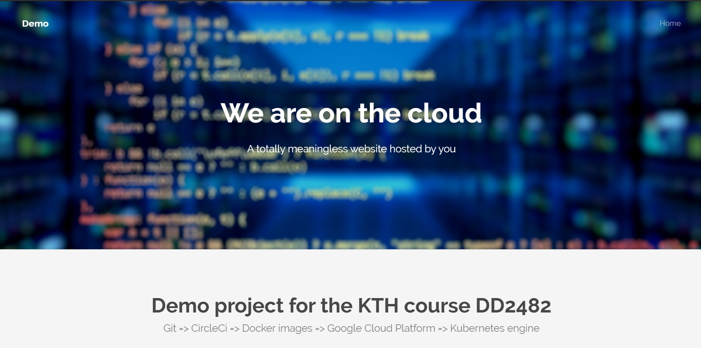

# Continuous development pipeline with CircleCI, Kubernetes and Google Cloud Platform
This repository provides the necessary code to be able to replicate the demo that can be found HERE. The demo is about how you 
combine CircleCI, Google cloud platform, Docker and Kubernetes in order to achieve continuous deployment. 

The demo requires that you have the following accounts and software.
* A terminal with Docker installed.
* A Google cloud platform account with credits on it. If you haven't used Google cloud platform before you will get some free credits when you are creating an account.
* Google cloud SDK installed on the terminal.
* A Github account.
* A CircleCI account.

The demo show how every push to the github repository will be processed by CircleCI and deployed to Google cloud platform.
 
